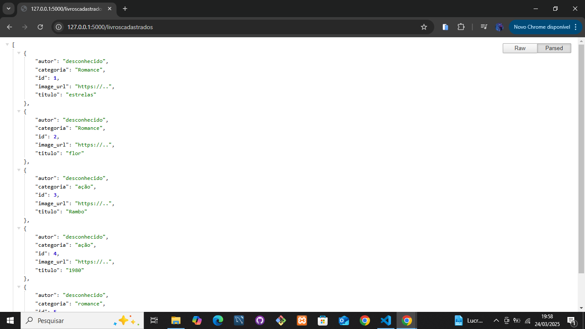

<!--  É readme ...MD É o marque dal é uma linguagem de marcação -->

<!-- # é um titulo -->
# API Livros Doados Vai na Web

Essa é uma Api simples feita com Flask e SQLite para fins de estudo na escola vai na web , ela permite cadastrar e listar os livros doados.

## Como rodar o projeto?

1. Faça o clone do repositório:

``` bash
    git clone <LINK_DO_REPOSITÓRIO >
    cd nome_do_projeto
```

2. Criar um ambiente virtual(Obrigatório):

```bash

**Windows**
python -m venv venv
source venv/Scripts/activate

**Linux/Mac**
python3 -m venv venv
source venv/bin/actvate
```

3. Instale as depenências :
```bash
pip install -r requirements.txt
```

4. Inicie o servidor:

```bash
python app.py
```
A API estara disponível nesse local em  http://127.0.0.1:5000/

## Endpoints 

### Post /doar

endpoit pra cadastro das informações do livro doado.

**Envio(JSON)**

```json

{
"autor": "desconhecido",
"categoria": "Romance",
"image_url": "https://..",
"titulo": "estrelas"
}
```

### Get /livroscadastrados

endpoit pra visualizar os livros cadastrados informações do livro doado.

**Visualização(JSON)**

```json

{
"autor": "desconhecido",
"categoria": "Romance",
"id": 1,
"image_url": "https://..",
"titulo": "estrelas"
}
```
Visualização da API :

